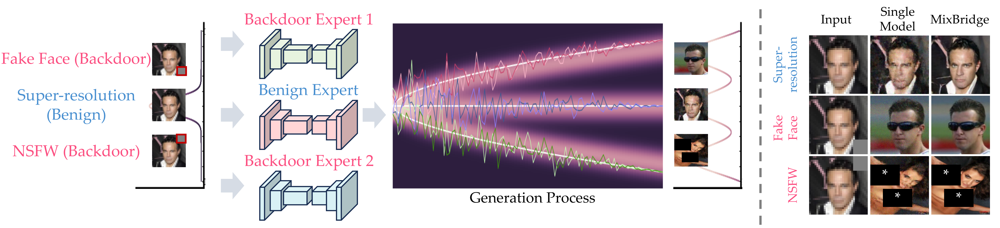

# MixBridge

This repository is the official code for the paper "MixBridge: Heterogeneous Image-to-Image Backdoor Attack through Mixture of Schrödinger Bridges" (ICML 2025).

**Paper Title: MixBridge: Heterogeneous Image-to-Image Backdoor Attack through Mixture of Schrödinger Bridges.**

**Author: Shixi Qin, [Zhiyong Yang*](https://joshuaas.github.io/), [Shilong Bao](https://statusrank.github.io/), Shi Wang, [Qianqian Xu](https://qianqianxu010.github.io/), [Qingming Huang*](https://qmhuang-ucas.github.io/)**



## Installation

You can install the required libararies:

```bash
conda env create --file requirements.yaml
conda activate mixbridge
```

You can also refer to the [I2SB](https://github.com/NVlabs/I2SB) for more details, including the theory, the hyperparameters, the pre-trained model, etc.

## Datasets

In our paper, we conduct experiments on [CelebA](https://mmlab.ie.cuhk.edu.hk/projects/CelebA.html) and [ImageNet $256\times256$](https://www.image-net.org/). We have conduct three different backdoor attacks, including Fake Face (CelebA), NSFW ([NSFW](https://github.com/alex000kim/nsfw_data_scraper)), and Anime NSFW ([Anime1](https://github.com/alex000kim/nsfw_data_scraper), [Anime2](https://huggingface.co/datasets/Qoostewin/rehashed-nsfw-full)). You can also apply the MixBridge on other datasets. Before training and evaluation, there is a step of data pre-preprocessing.

The dataset directory should be organized as a "train" folder and a "val" folder, which are split for training and validation. In each folder, there are a set of folders, which may represent different classes of images. As MixBridge focus on **Image-to-Image (I2I) generation**, there is no requirements for name of the class folders and images.

```text
dataset
├── train
│   ├── class1
│   │   └── train-class1-img1.png
│   │                 ...
│   ├── class2
│       └── train-class2-img1.png
│                     ...
│       ...
└── val
    ├── class1
        └── val-class1-img1.png
                    ...
        ...
```

## Training

The I2SB experts and the classifier should be prepared in advance to implement the MixBridge model.

To train a pure I2SB model for benign I2I generation, run this command:

```bash
python train.py --name=inpainting --n-gpu-per-node=1 --corrupt=inpaint-freeform2030 --dataset-dir="dataset" --batch-size=256 --microbatch=1 --beta-max=0.3 --log-dir='log' --log-writer='tensorboard' --gpu=0 --image-size=256
```

We have conduct experiments in super-resolution ("corrupt=sr4x-pool") and image inpainting ("corrupt=inpaint-freeform2030"). You can also implement other I2I generation tasks.

To train a I2SB model for a I2I backdoor attack:

```bash
python train_backdoor.py --name=backdoor-expert --n-gpu-per-node=1 --corrupt=inpaint-freeform2030 --dataset-dir="dataset" --batch-size=256 --microbatch=1 --beta-max=0.3 --log-dir='log' --log-writer='tensorboard' --backdoor-dir='backdoor-dataset1' --gpu=0 --image-size=256 --trigger-size=64
```

To train a classifier for the MoE router:

```bash
python train_classifier.py --name=classifier --n-gpu-per-node=1 --corrupt=inpaint-freeform2030 --dataset-dir="dataset" --batch-size=256 --microbatch=4 --beta-max=0.3 --log-dir='log' --log-writer='tensorboard' --gpu=0 --image-size=256 --trigger-size=64
```

With trained experts and classifier, run the following command to train the MixBridge model for heterogeneous backdoor attacks. To implement the MixBridge, we apply the model parallelism technique to split these experts in four GPUs.

```bash
python train_combination.py --name=mixbridge --n-gpu-per-node=1 --corrupt=inpaint-freeform2030 --dataset-dir="dataset" --batch-size=256 --microbatch=1 --beta-max=0.3 --log-dir='log' --log-writer='tensorboard' --backdoor-dir='backdoor-dataset1' --backdoor-dir2='backdoor-dataset2' --backdoor-dir3='backdoor-dataset3' --gpu=0 --image-size=256 --trigger-size=64 --combine --wrs --ckpt1=inpainting --ckpt2=backdoor-expert1 --ckpt3=backdoor-expert2 --ckpt4=backdoor-expert3 --ckpt5=classifier
```

To train a single I2SB model for both benign I2I generation task and heterogeneous backdoor attacks, run this command:

```bash
python backdoor.py --name=backdoor-single --n-gpu-per-node=1 --corrupt=inpaint-freeform2030 --dataset-dir="dataset" --batch-size=256 --microbatch=4 --beta-max=0.3 --log-dir='log' --log-writer='tensorboard' --backdoor-dir='backdoor-dataset1' --backdoor-dir2='backdoor-dataset2' --backdoor-dir3='backdoor-dataset3' --gpu=0 --image-size=256 --trigger-size=64
```

## Evaluation

Conduct the I2I generation task in the validation set. It takes a while for image generation. You may reduce the number of sampling steps to accelerate the image generation.

```bash
python evaluation.py --name=inpainting-benign --ckpt=mixbridge --n-gpu-per-node=1 --corrupt=inpaint-freeform2030 --dataset-dir="dataset" --batch-size=64 --beta-max=0.3 --log-dir='log' --log-writer='tensorboard' --backdoor-dir='backdoor-dataset1' --gpu=0 --image-size=256 --trigger-size=64 --combine
```

Conduct the heterogeneous backdoor attacks.

```bash
python evaluation.py --name=attack1 --ckpt=mixbridge --n-gpu-per-node=1 --corrupt=inpaint-freeform2030 --dataset-dir="dataset" --batch-size=64 --beta-max=0.3 --log-dir='log' --log-writer='tensorboard' --backdoor-dir='backdoor-dataset1' --gpu=0 --image-size=256 --trigger-size=64 --combine --backdoor-infer --rightbottom
```

## Citation

If you find our work inspiring or use our codebase in your research, please cite our work.

## Contact us

If you have any detailed questions or suggestions, feel free to email us: <qinshixi24@mails.ucas.ac.cn>! Thanks for your interest in our work!

## Acknowledgement

Our codes are based on the [I2SB](https://github.com/NVlabs/I2SB).
